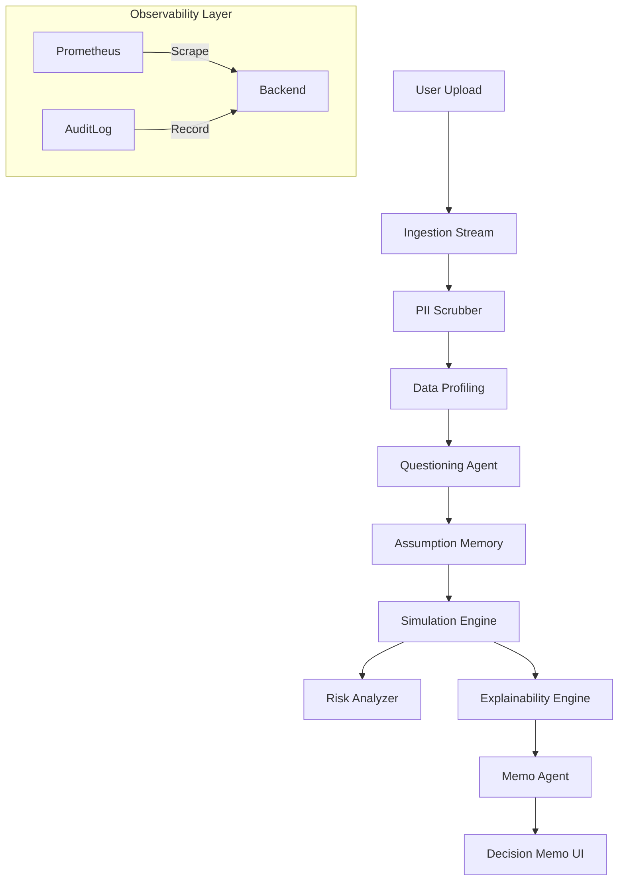

# AI Decision Copilot 🧠

> **The OS for Strategic Decision Making.**
> Turn messy data into "Executive-Ready" memos with probabilistic modeling, agentic reasoning, and enterprise-grade security.


## 🚀 Overview
**AI Decision Copilot** transforms the traditional FP&A workflow. Instead of static spreadsheets, it provides a dynamic, agent-driven interface to:
1.  **Ingest & Profile**: Instantly detect anomalies in financial datasets (Revenue, Costs, Headcount).
2.  **Model Uncertainty**: Run 1000+ Monte Carlo simulations to find P10/P90 confidence intervals.
3.  **Stress Test**: Automatically check business health against "Recession" or "Inflation" scenarios.
4.  **Synthesize**: Generate succinct, evidence-based Decision Memos using a multi-agent LLM system.

---

## ✨ Key Features

### 1. 🛡️ Enterprise Security & Compliance
*   **PII Masking**: Automatically detects and redacts sensitive data (Email, SSN) upon ingestion.
*   **Audit Trail**: Verifiable, immutable logs for every business action (Upload, Simulate, Delete).
*   **GDPR Ready**: Dedicated "Right to be Forgotten" endpoints (`DELETE /api/admin/data/{id}`).
*   **Threat Modeled**: Built securely from the ground up (see [Threat Model](docs/ThreatModel.md)).

### 2. 📊 Intelligent Ingestion
*   **Stream Processing**: Handles large datasets (1M+ rows) with <100MB RAM footprint.
*   **Auto-Health Check**: Scores data quality (0-100) based on missingness, outliers, and type consistency.

### 3. 🧪 Science-Backed Simulation Engine
*   **Monte Carlo**: Simulates probabilistic outcomes (e.g., Revenue +/- 10%) to quantify risk.
*   **Break-even Analysis**: Calculates exact "failure points" (e.g., "Cash flow turns negative if Revenue drops < $30k").
*   **Constraint Enforcement**: Respects hard business rules (e.g., "Marketing Spend cannot exceed $50k").

### 4. 🤖 Agentic Reasoning Layer
*   **Questioning Agent**: Detects ambiguity and asks "Must-Ask" clarifying questions.
*   **Scenario Agent**: Suggests "Conservative" vs "Aggressive" plans based on constraints.
*   **Memo Agent**: Drafts BLUF (Bottom Line Up Front) memos suitable for C-level review.

### 5. 🔭 MLOps & Observability
*   **PromptOps**: Prompts managed as configuration (`yaml`), not code.
*   **Golden Signals**: Real-time tracking of Latency, Errors, and Token Usage via Prometheus.
*   **CI/CD Pipeline**: Automated testing, linting, and security scanning on every push.

---

## 🛠️ Architecture



## ⚡ Quick Start

### Option 1: Docker (Recommended)
Run the full stack (Backend + Frontend + Prometheus) with one command:

```bash
docker-compose up --build
```
*   **App**: http://localhost:5173
*   **API**: http://localhost:8000
*   **Metrics**: http://localhost:9090

### Option 2: Local Development

**Backend**
```bash
cd backend
python3 -m venv venv
source venv/bin/activate
pip install -r requirements.txt
python3 main.py
```

**Frontend**
```bash
npm install
npm run dev
```

## 📚 Documentation
*   [**Operations Runbook**](docs/OPERATIONS.md): Deployment, Rollback, and Monitoring procedures.
*   [**Release Runbook**](docs/RELEASE_RUNBOOK.md): release checklists.
*   [**Threat Model**](docs/ThreatModel.md): Security analysis.
*   [**Task Tracker**](task.md): Current project status.

## 🧪 Running Tests
We maintain high test coverage for the Science and Agent layers.

```bash
# Run all tests (Unit, Integration, Security)
python3 -m pytest tests/
```

## 📂 Project Structure
```text
├── backend/
│   ├── agents/         # AI Logic (Orchestrator, Memory)
│   ├── config/         # Prompt Configuration (YAML)
│   ├── engine/         # Physics of Decision (Simulation, Risk)
│   ├── routers/        # API Endpoints
│   ├── services/       # Core Business Logic (ETL, Audit, Monitoring)
│   └── main.py         # Entry point & Middleware
├── src/                # React Frontend
│   ├── components/     # UI Components
│   └── ...
├── docs/               # Detailed Documentation
├── tests/              # Automated Test Suite
├── Dockerfile          # Container Definition
└── docker-compose.yml  # Orchestration
```

## 📄 License
MIT License. Built with ❤️ for Decision Makers.
